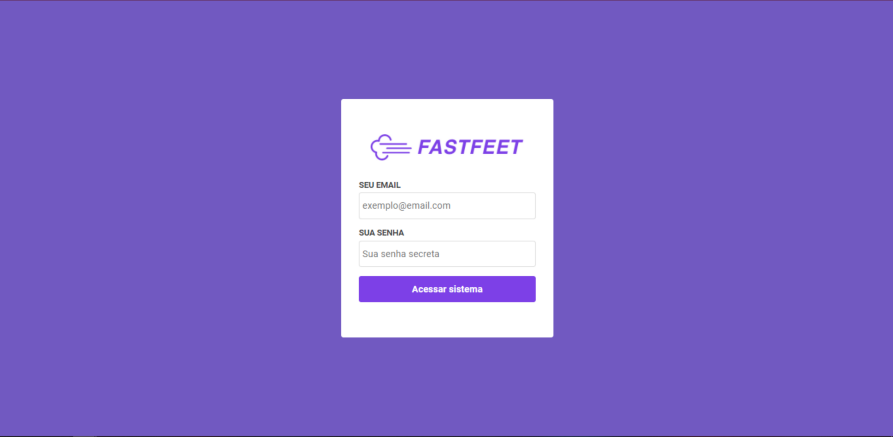
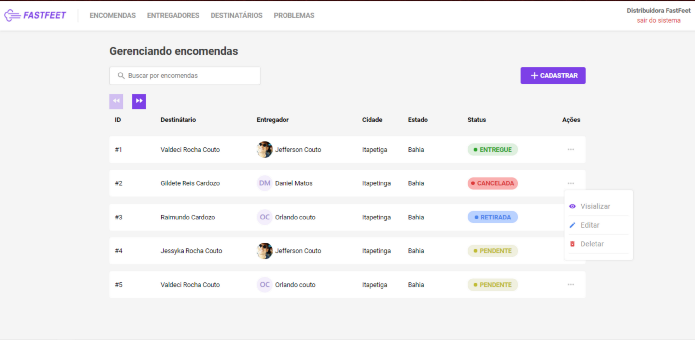
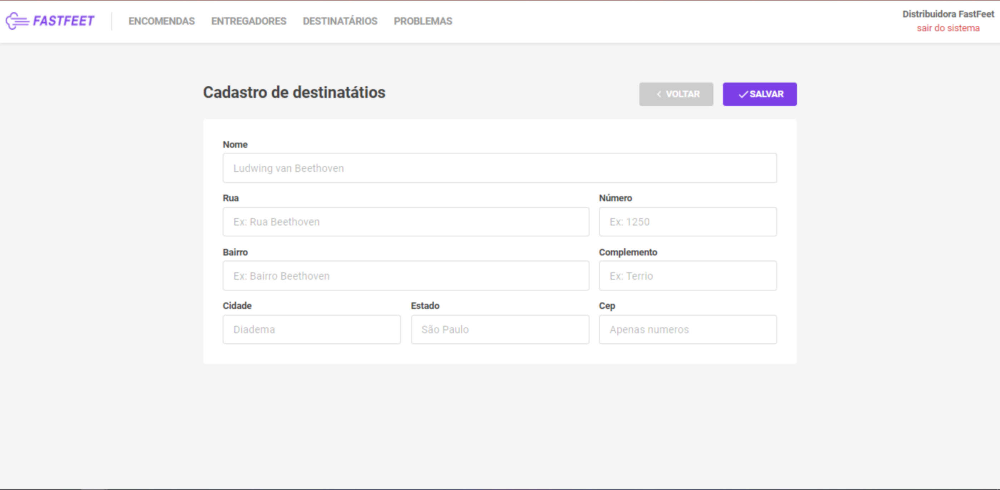
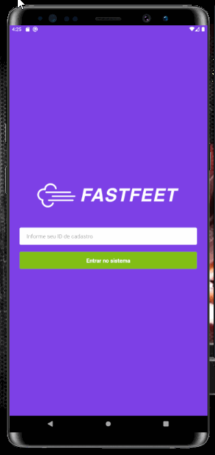

<h1 align="center">
  
</h1>

<h3 align="center">
  Trata-se de uma aplicação completa (back-end, front-end e mobile) densevolvida com NodeJS, ReactJS e React Native para uma transportadora fictícia, o FastFeet.
</h3>

# Instruções para executar a aplicação.

Faça o download do repositório e siga as instruções:

Este procedimento foi testado usando o Windws 10 e o emulador Android Studio.

Para criação das bases de dados foi utilizado o docker. Com o docker devidamente instalado e configurado na sua máquina, abra o terminal e rode o seguinte comando:

```
  docker run --name fastfeetDB -e POSTGRES_PASSWORD=docker -p 5432:5432 -d postgres
```
O contêiner postgres foi criado com o nome `fastfeetDB` e a senha `docker`.
Essas informações serão importantes para configurar o arquivo .env na raiz do backend.

Com o Postbird ou qualquer outro aplicativo gráfico para gerenciar bases de dados, conecte-se ao postgress e crie uma base de dados com o nome fastfeet.

Para tratar de envio de e-mails, vomos utilizar o Redis. De novo no terminar, rode o seguinte comando:

```
  docker run --name redisFastFeet -p 6379:6379 -d -t redis:alpine 
```

## Backend

Na pasta raiz do projeto backend, duplique o arquivo .env.example e salve com o nome .env. Em seguida preencha as variáveis no novo arquivo conforme as configurações do passo anterior.

Todos os comando a seguir devem ser executados com o terminal na raiz da pasta backend.

Para instalar as dependências do projeto, rode comando:

```
  yarn
```

Para criação das tabelas na base de dados:

```
yarn sequelize db:migrate
```

O proximo comando criará o usuário administrador do FastFeed, que terá as credenciais: email `admin@fastfeet.com` e senha `123456`. Para criar o usuário administrador utilize o comando:

```
yarn sequelize db:seed:all
```

O comando para startar o servidor é:

```
yarn dev
```
É hora de subir o servidor responsável pelo gerenciamento de filas de envio de emails.

```
yarn queue
```

Se tudo deu certo o backend do FastFeed já deve está pronto.

### tecnologias aplicadas

- Node
- Express
- Sequelize
- Docker
- Redis
- Bequeue
- Nodemailer
- handlebars
- eslint
- prettier
- nodemon

## WEB

Na pasta raiz do projeto frontend, roder o seguinte comando para instalar as dependências.

```
  yarn
```
Agora para iniciar a aplicação WEB basta rodar:

```
  yarn start
```

A aplicação vai se iniciar na tela de login. Acesse a aplicação usando as credenciais do usuário administrador.

## Captura de algumas telas da aplicação web


<div>


### tecnologias aplicadas

- ReactJS
- eslint
- prettier
- redux
- redux-saga
- redux-persist
- styled-components

## Mobile

Agora na pasta do projeto mobile, rode o seguinte comando para instalar as dependências:

```
  yarn
```

Com o emulador android aberto, rode o comando:

```
react-native run-android
```

### APENAS PARA IOS

Para testar a aplicação no IOS, instale os pods rodando:

```
cd ios && pod install && cd ..
```

Agora e só rodar o comando:

```
react-native run-ios
```

### Captura de telas do app FastFeed mobile

<h1 align="center">
  
</h1>

### tecnologias aplicadas

- React Native
- eslint
- prettier
- redux
- redux-saga
- redux-persist
- styled-components

## 📝 Licença

Esse projeto está sob a licença MIT. Veja o arquivo [LICENSE](LICENSE.md) para mais detalhes.

---

© 2021 por Jefferson | ♥ to Rocketseat
